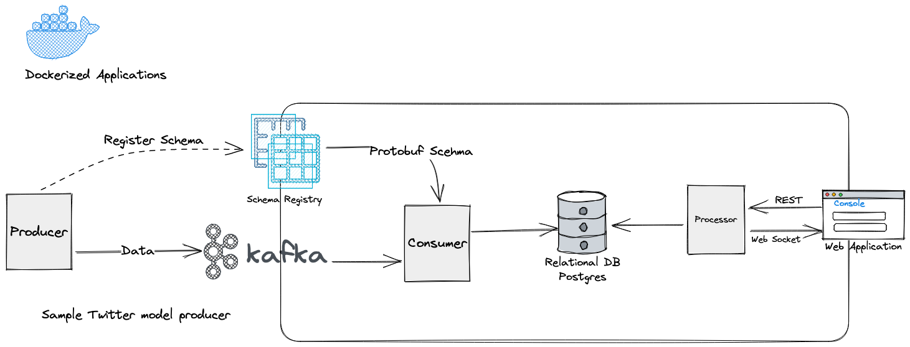

# stateful-stream-processing
My university proposal on Stateful Stream Processing

- [stateful-stream-processing](#stateful-stream-processing)
  - [Problem Description](#problem-description)
    - [Architecture](#architecture)
    - [Architecture - AWS Deployment](#architecture---aws-deployment)
    - [Architecture - Dev Env](#architecture---dev-env)
  - [Development Environment](#development-environment)

## Problem Description
TODO

### Architecture

TODO

### Architecture - AWS Deployment

TODO

### Architecture - Dev Env

TODO

## Development Environment
To run the project in dev env, make sure you have [Docker]([dasd](https://docs.docker.com/get-docker/))
and [Docker-Compose](https://docs.docker.com/compose/install/) installed.
Then, to run the infrastructure for Kafka and Database, run:

```bash
docker-compose -f infra.docker-compose.yml up
```

Wait for few minutes and after you see logs related to Kafka working normally, then run the producer and consumer applications:

```bash
docker-compose -f app.docker-compose.yml up
```

This will run the applications.
If you changed any part of the applications, including `producer`, `consumer` or `processor` you need to re-build the Docker images.

```bash
docker-compose -f app.docker-compose.yml up --build
```

If you wanted to tear down everything, then simply run:
```bash
docker-compose down
```

**NOTE:** This will also deletes all of the Kafka topics and database, Be careful if you want keep the data produced in it.
